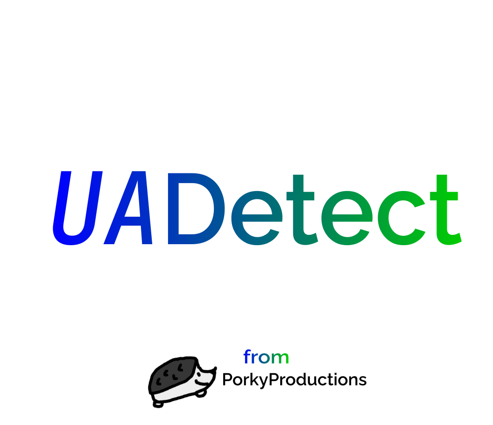
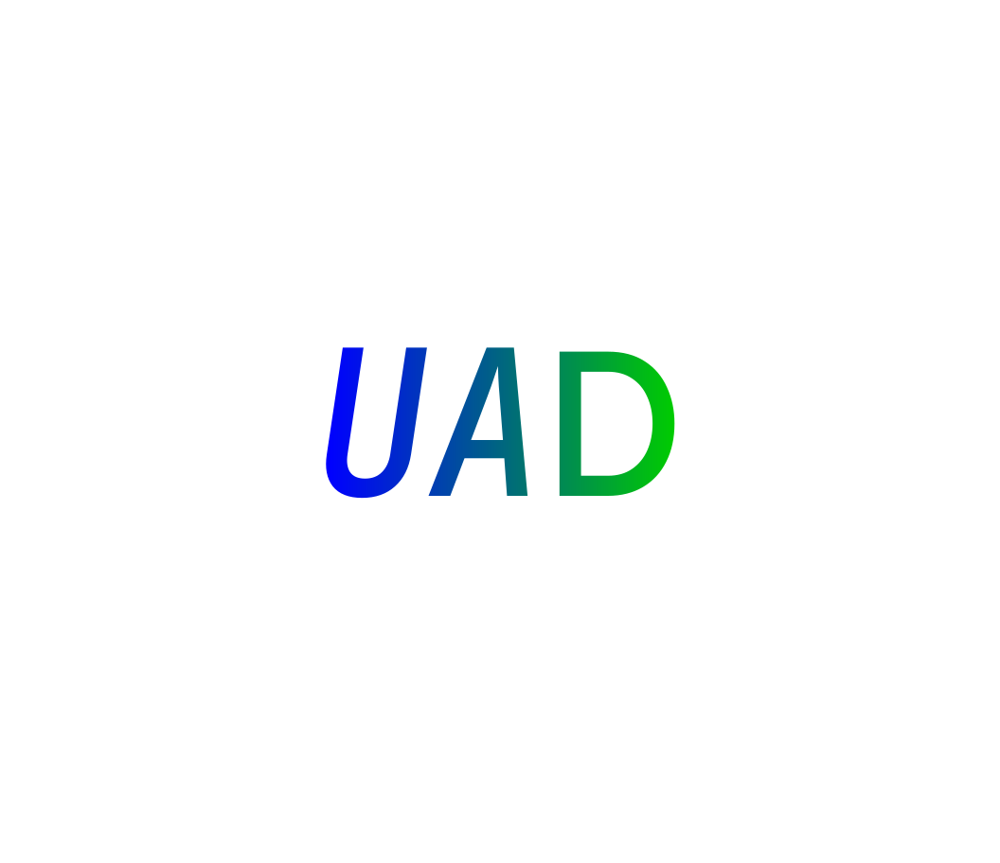

# UADetect



- [UADetect](#uadetect)
  - [Description](#description)
  - [Technologies Used](#technologies-used)
    - [Features](#features)
    - [Works On](#works-on)
  - [Installation](#installation)
    - [via `npm`](#via-npm)
  - [Documentation](#documentation)


## Description

✨The dead-simple way of interacting with the navigator API.✨

It may say "UA", but we're way more than that. UADetect is the eaisiet way to interact with the navigator API. We have lots of componets, and they all are well documented in the [docs](./docs/index.md).

## Technologies Used


### Features

- ✏️ **Fully typed API**
  - This libray is written 100% in TypeScript with strict type gaurentees. That means you get full autocomplete from your IDE when writing with UADetect **automatically**
- ⏹️🏫🌳 **Objects, Classes, or Tree-Shaking** 
  -  UADetect comes with three main ways to use it. You can use the `UADetect` object, the `uaDetect` class, or import each or any of the components outlined in the [docs](/docs/index.md)
### Works On

     

## Installation
### via `npm`

Install the `uadetect` package

```bash
npm i -d uadetect
```


## Documentation

Read all about how to use the package in the [Docs](/docs/index.md)

